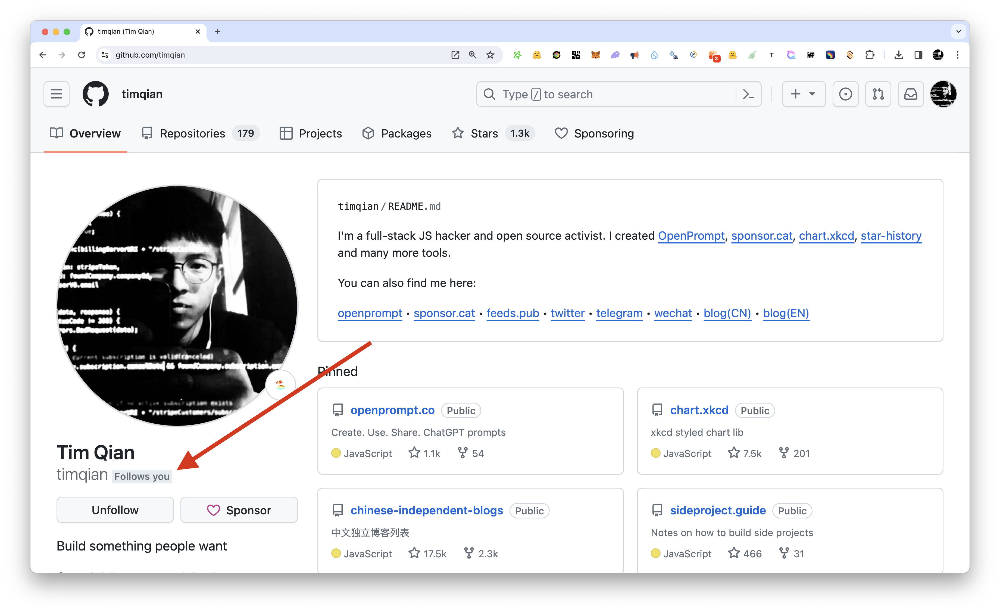

# Follows You?

Check if a user is following you on GitHub.

## Screenshots

When a user follows you:

When a user is not following you:

If no tag show up, it means the extension have trouble accessing github APIs.